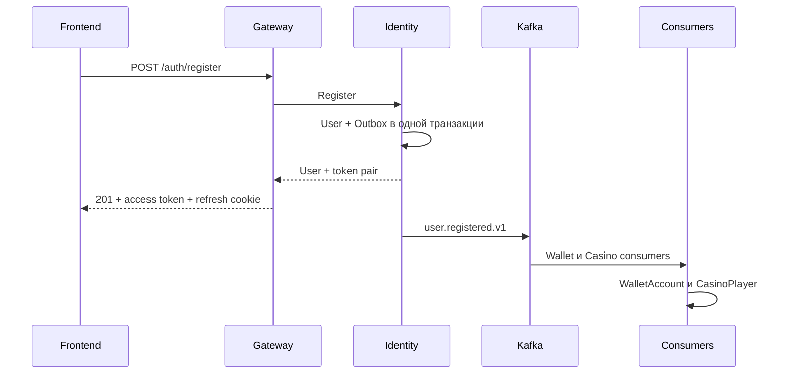
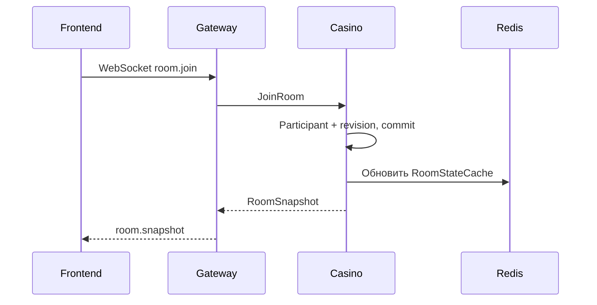
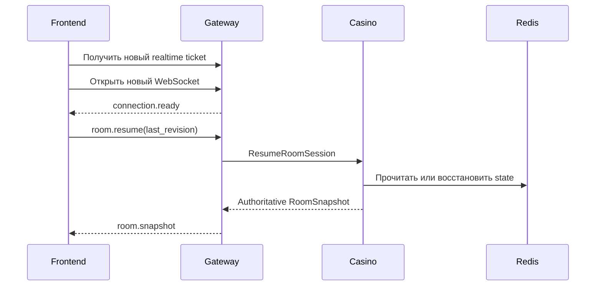
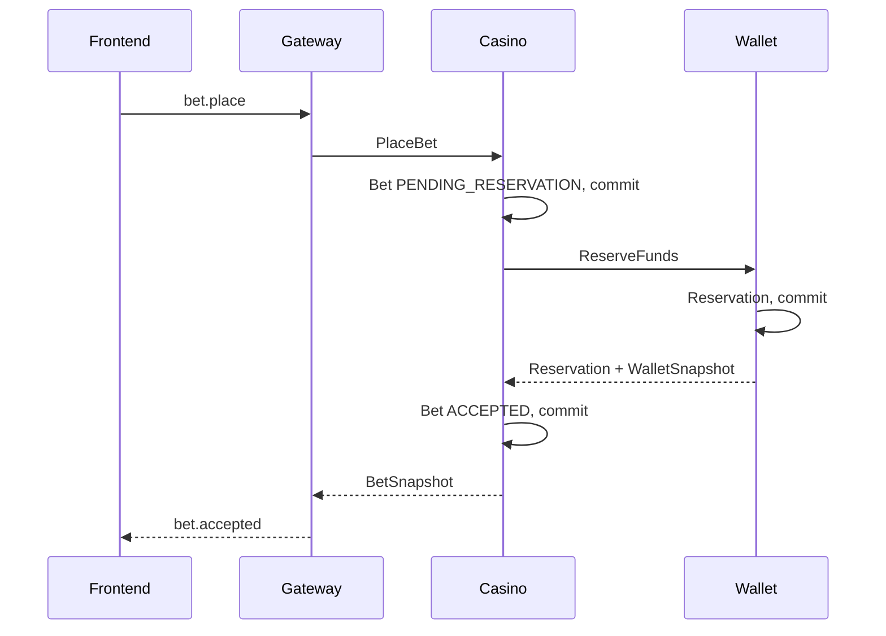
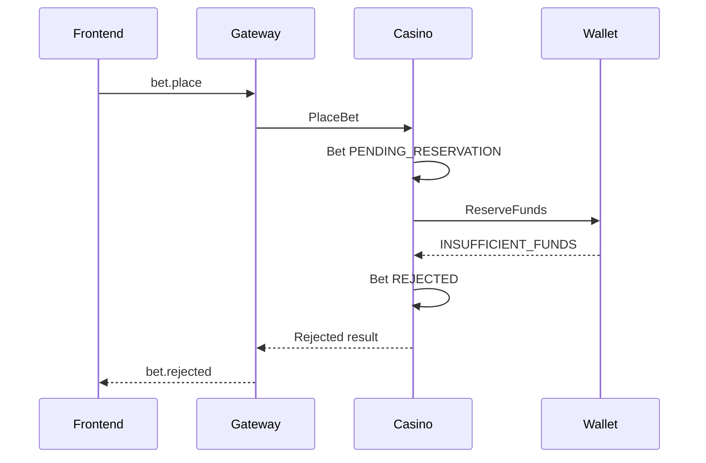
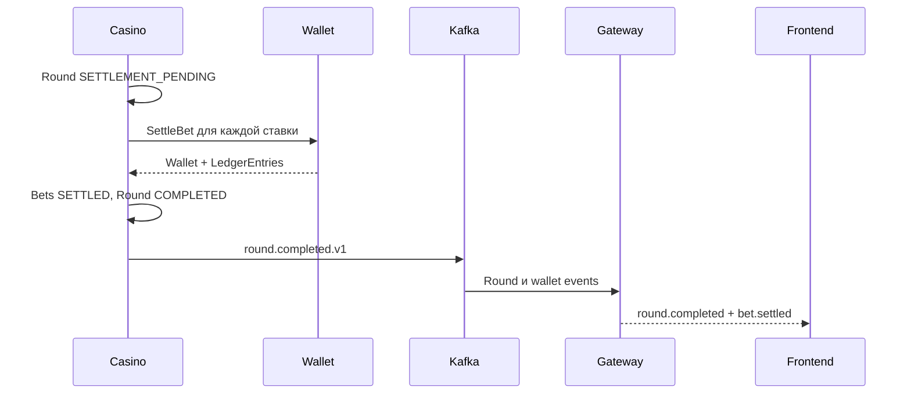
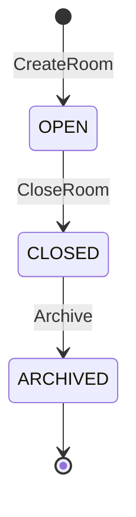
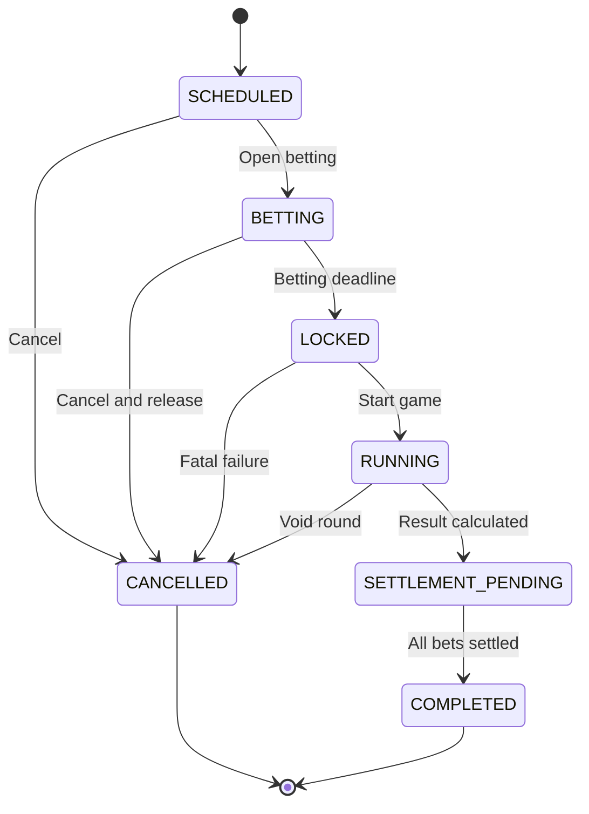
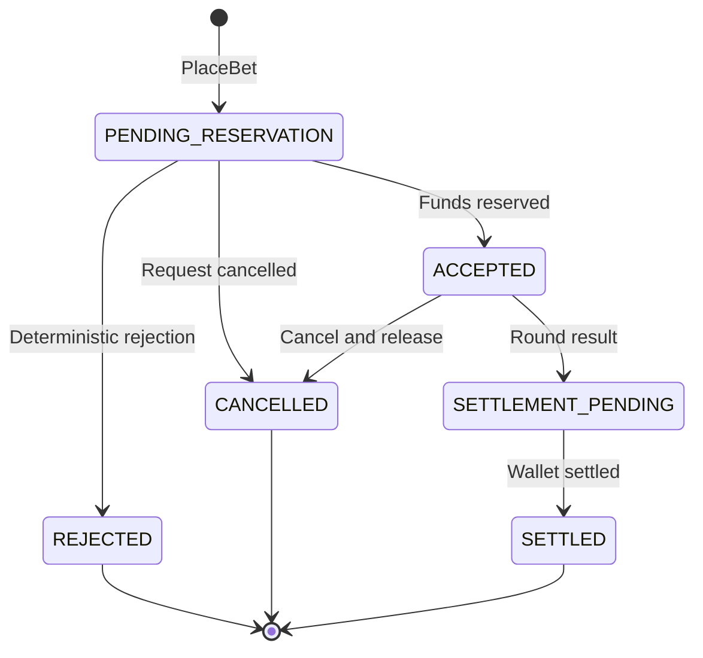
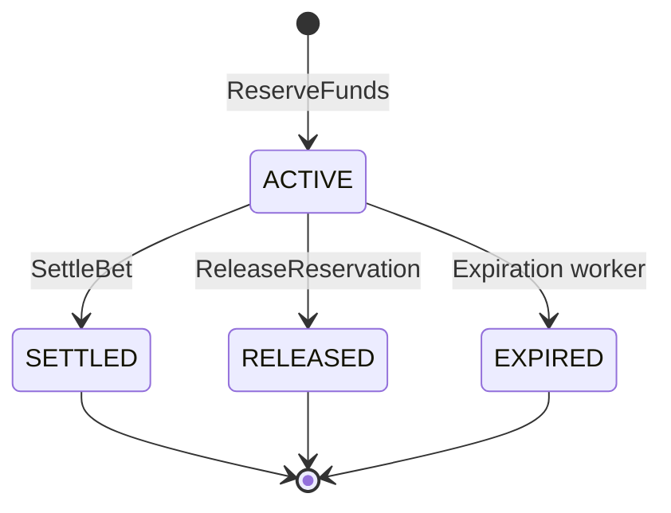

# Service Communication

Статус: архитектурный контракт для начала параллельной разработки.

Документ определяет:

- границы четырёх сервисов;
- владельцев данных;
- используемые протоколы;
- синхронные и асинхронные взаимодействия;
- обработку duplicate request, timeout и partial failure;
- state machines основных сущностей.

---

## 1. Сервисы

| Сервис | Ответственность |
|---|---|
| Gateway | HTTP API, WebSocket, edge authentication, routing, преобразование DTO |
| Identity | Пользователи, credentials, роли, permissions, refresh sessions |
| Wallet | WalletAccount, Reservation, LedgerEntry, изменение баланса |
| Casino | CasinoPlayer, Room, RoomParticipant, Round, Bet, игровое состояние |

Правила:

1. Каждый сервис владеет своей PostgreSQL.
2. Сервис не читает и не изменяет чужую PostgreSQL.
3. Gateway не содержит бизнес-логику Casino, Identity или Wallet.
4. Gateway не является владельцем room state.
5. Casino является единственным writer Casino state в PostgreSQL и Redis.
6. Синхронный результат передаётся через gRPC.
7. Асинхронные события передаются через Kafka.
8. Kafka не является заменой PostgreSQL.
9. Событие публикуется через transactional outbox.
10. Consumer обрабатывает события идемпотентно.

---

## 2. Владение данными

| Данные | Владелец | Хранилище |
|---|---|---|
| User | Identity | Identity PostgreSQL |
| Credentials-поля | Identity | Identity PostgreSQL |
| RefreshSession | Identity | Identity PostgreSQL |
| Role и permissions mapping | Identity | Code configuration |
| WalletAccount | Wallet | Wallet PostgreSQL |
| Reservation | Wallet | Wallet PostgreSQL |
| LedgerEntry | Wallet | Wallet PostgreSQL |
| CasinoPlayer | Casino | Casino PostgreSQL |
| Room | Casino | Casino PostgreSQL |
| RoomParticipant | Casino | Casino PostgreSQL |
| Round | Casino | Casino PostgreSQL |
| Bet | Casino | Casino PostgreSQL |
| RoomStateCache | Casino | Redis |
| Realtime ticket | Gateway | Redis |
| WebSocket connection | Gateway | Process memory |
| OutboxMessage | Каждый producer | PostgreSQL соответствующего сервиса |
| ProcessedEvent/Inbox | Каждый consumer | PostgreSQL соответствующего сервиса |

Redis не является источником истины для долговечных финансовых данных.

LedgerEntry после создания не изменяется и не удаляется обычной бизнес-логикой.

---

## 3. Протоколы

### 3.1 HTTP

Используется только между Frontend и Gateway.

```text
Frontend → Gateway
```

HTTP используется для:

- регистрации и авторизации;
- чтения пользователя;
- чтения Wallet и ledger;
- получения списка комнат;
- создания комнаты;
- чтения room/round/bet snapshots;
- получения realtime ticket.

### 3.2 WebSocket

Используется между Frontend и Gateway.

```text
Frontend ↔ Gateway
```

WebSocket используется для:

- входа и выхода из комнаты;
- reconnect;
- ставок;
- игровых действий;
- realtime snapshots;
- broadcast событий;
- обновления баланса.

### 3.3 gRPC

Используется для синхронных внутренних вызовов.

```text
Gateway → Identity
Gateway → Wallet
Gateway → Casino
Casino → Wallet
```

Frontend не вызывает gRPC.

### 3.4 Kafka

Используется для асинхронной доставки событий.

Kafka применяется, когда:

- producer не должен ждать выполнения consumer;
- допускается eventual consistency;
- событие должно быть обработано несколькими consumers;
- требуется повторная доставка после временной ошибки.

Kafka delivery принимается как at-least-once. Consumer обязан ожидать дубликаты.

---

## 4. RequestContext

Gateway создаёт внутренний `RequestContext` после проверки access token.

```text
request_id
actor_identity_user_id
permissions
```

Правила:

- клиентский `actor_identity_user_id` не принимается;
- клиентский список permissions не принимается;
- Gateway заполняет actor и permissions самостоятельно;
- `request_id` используется для correlation и tracing;
- `request_id` не используется как idempotency key;
- внутренний сервис проверяет необходимые permissions;
- в production внутренние вызовы дополнительно защищаются сетевой политикой или mTLS.

Для неавторизованных операций `actor_identity_user_id` отсутствует либо остаётся пустым согласно контракту RPC.

---

## 5. Синхронные вызовы

### 5.1 Gateway → Identity

| RPC | Назначение |
|---|---|
| `Register` | Создать User и token pair |
| `Login` | Проверить credentials и создать refresh session |
| `RefreshToken` | Выполнить ротацию refresh token |
| `Logout` | Отозвать одну или все refresh sessions |
| `GetMe` | Получить текущего пользователя |
| `GetUser` | Получить пользователя по ID |
| `ListUsers` | Административный список |
| `BlockUser` | Заблокировать пользователя |

### 5.2 Gateway → Wallet

| RPC | Назначение |
|---|---|
| `GetWallet` | Получить Wallet snapshot |
| `ListLedgerEntries` | Получить ledger пользователя |

Gateway не вызывает финансовые команды от имени Casino.

### 5.3 Gateway → Casino

| RPC | Назначение |
|---|---|
| `CreateRoom` | Создать комнату |
| `ListRooms` | Получить комнаты |
| `GetRoomSnapshot` | Получить authoritative room snapshot |
| `JoinRoom` | Добавить игрока в комнату |
| `LeaveRoom` | Вывести игрока из комнаты |
| `CloseRoom` | Закрыть комнату |
| `MarkParticipantDisconnected` | Отметить разрыв соединения |
| `ResumeRoomSession` | Восстановить участие и получить snapshot |
| `GetRound` | Получить раунд |
| `GetCurrentRound` | Получить текущий раунд комнаты |
| `ListRounds` | Получить историю раундов |
| `SubmitRoundAction` | Выполнить игровое действие |
| `PlaceBet` | Создать ставку |
| `CancelBet` | Отменить ставку |
| `GetBet` | Получить ставку |
| `ListMyBets` | Получить ставки пользователя |

### 5.4 Casino → Wallet

| RPC | Назначение |
|---|---|
| `ReserveFunds` | Зарезервировать сумму ставки |
| `SettleBet` | Завершить ставку и записать ledger |
| `ReleaseReservation` | Освободить резерв |
| `CreditReward` | Начислить награду |
| `AdjustBalance` | Административно скорректировать баланс |

---

## 6. Kafka event envelope

Каждое Kafka-событие использует envelope:

```json
{
  "event_id": "uuid",
  "event_type": "user.registered.v1",
  "occurred_at": "2026-08-08T12:30:00Z",
  "producer": "identity-service",
  "correlation_id": "request-id",
  "causation_id": "command-or-event-id",
  "payload": {}
}
```

Поля:

| Поле | Назначение |
|---|---|
| `event_id` | Идемпотентность обработки события |
| `event_type` | Тип и версия схемы |
| `occurred_at` | Время создания события |
| `producer` | Сервис-источник |
| `correlation_id` | Связь логов одного пользовательского сценария |
| `causation_id` | Команда или событие, вызвавшее текущее событие |
| `payload` | Версионированные данные события |

Consumer создаёт запись Inbox/ProcessedEvent с уникальным `event_id`.

Повторное событие с уже обработанным `event_id` подтверждается без повторного изменения данных.

---

## 7. Асинхронные события

| Producer | Event | Consumer | Результат |
|---|---|---|---|
| Identity | `user.registered.v1` | Wallet | Создать WalletAccount |
| Identity | `user.registered.v1` | Casino | Создать CasinoPlayer |
| Casino | `round.started.v1` | Gateway | Broadcast начала раунда |
| Casino | `round.completed.v1` | Gateway | Broadcast завершения раунда |
| Casino | `round.completed.v1` | Casino projections | Статистика и leaderboard |
| Casino | `bet.settled.v1` | Gateway | Broadcast результата ставки |
| Wallet | `wallet.balance_changed.v1` | Gateway | Обновить баланс игрока |

На foundation-этапе Kafka ещё может быть не запущена, но producer и consumer не должны нарушать указанные границы.

### 7.1 `user.registered.v1`

```json
{
  "event_id": "uuid",
  "event_type": "user.registered.v1",
  "occurred_at": "2026-08-08T12:30:00Z",
  "producer": "identity-service",
  "correlation_id": "request-id",
  "causation_id": "register-command-id",
  "payload": {
    "identity_user_id": "uuid",
    "nickname": "player_one",
    "registered_at": "2026-08-08T12:30:00Z"
  }
}
```

Email и password hash не передаются Casino.

Wallet получает `identity_user_id`, но не получает credentials.

### 7.2 `round.completed.v1`

```json
{
  "event_id": "uuid",
  "event_type": "round.completed.v1",
  "occurred_at": "2026-08-08T12:40:10Z",
  "producer": "casino-service",
  "correlation_id": "round-id",
  "causation_id": "round-settlement-command-id",
  "payload": {
    "round_id": "uuid",
    "room_id": "uuid",
    "game_type": "crash",
    "round_number": 18,
    "revision": 81,
    "completed_at": "2026-08-08T12:40:10Z"
  }
}
```

Полный результат Gateway при необходимости получает из Casino либо из согласованного event payload. Событие не содержит закрытых fairness-данных до момента их раскрытия.

### 7.3 `wallet.balance_changed.v1`

```json
{
  "event_id": "uuid",
  "event_type": "wallet.balance_changed.v1",
  "occurred_at": "2026-08-08T12:40:10Z",
  "producer": "wallet-service",
  "correlation_id": "request-id",
  "causation_id": "wallet-operation-id",
  "payload": {
    "wallet_account_id": "uuid",
    "identity_user_id": "uuid",
    "accounting_balance_minor": 105000,
    "reserved_amount_minor": 0,
    "available_balance_minor": 105000,
    "currency": "USD",
    "version": 8
  }
}
```

Gateway не записывает этот баланс в Wallet PostgreSQL. Он только передаёт обновление нужному WebSocket-клиенту.

---

## 8. Transactional outbox

Producer не выполняет последовательность:

```text
COMMIT business data
publish Kafka event
```

без outbox, потому что процесс может завершиться между двумя действиями.

Правильная транзакция:

```text
BEGIN
изменить business data
добавить OutboxMessage
COMMIT
```

После commit отдельный publisher:

1. читает необработанные OutboxMessage;
2. публикует событие в Kafka;
3. помечает сообщение опубликованным;
4. повторяет отправку после временной ошибки.

Kafka может получить событие повторно. Consumer удаляет дубликаты по `event_id`.

---

# 9. Flow 1: регистрация и создание Wallet

## 9.1 Успешный сценарий



Identity в одной PostgreSQL-транзакции:

1. проверяет уникальность email;
2. создаёт User;
3. сохраняет password hash;
4. создаёт RefreshSession;
5. добавляет `user.registered.v1` в outbox;
6. выполняет commit.

После commit Gateway уже может вернуть успешную регистрацию.

Wallet и CasinoPlayer создаются асинхронно.

## 9.2 Duplicate request

Повтор регистрации может возникнуть после потери HTTP-ответа.

Обязательные ограничения:

- `User.email` уникален после нормализации;
- повтор не создаёт второго User;
- повтор Kafka event не создаёт второй Wallet;
- повтор Kafka event не создаёт второй CasinoPlayer;
- `WalletAccount.identity_user_id` уникален;
- `CasinoPlayer.identity_user_id` уникален;
- consumer сохраняет обработанный `event_id`.

Если регистрация будет поддерживать `Idempotency-Key`, одинаковый ключ и payload должны возвращать исходный результат.

## 9.3 Timeout

Если Gateway не получил ответ Identity:

- Gateway возвращает `504 UPSTREAM_TIMEOUT`;
- Gateway не считает регистрацию неуспешной автоматически;
- клиент не должен менять email для повторной попытки;
- состояние проверяется через повторную регистрацию или будущий idempotency record.

Если Identity успел выполнить commit, User и outbox остаются сохранёнными.

## 9.4 Partial failure

### Identity commit выполнен, Kafka недоступна

- пользователь может войти;
- OutboxMessage остаётся необработанным;
- publisher повторяет публикацию;
- `GET /wallet/me` временно возвращает `503 WALLET_PROVISIONING`.

### Wallet создался, CasinoPlayer не создался

- Wallet остаётся действительным;
- Casino consumer повторяет событие независимо;
- пользователь временно не может войти в Casino;
- Identity transaction не откатывается.

### Consumer завершился после commit, но до Kafka acknowledgement

Kafka повторно доставляет событие. Inbox/unique constraint предотвращает создание дубликата.

---

# 10. Flow 2: join room, disconnect и reconnect

## 10.1 Успешный join



Casino:

1. определяет CasinoPlayer через actor identity;
2. проверяет существование и статус комнаты;
3. проверяет invite token приватной комнаты;
4. проверяет capacity;
5. проверяет, что игрок ещё не является активным участником;
6. создаёт или восстанавливает RoomParticipant;
7. увеличивает `Room.revision`;
8. выполняет commit;
9. обновляет принадлежащий Casino Redis cache;
10. возвращает полный RoomSnapshot.

PostgreSQL содержит долговечные данные участия. Redis используется для быстрого realtime state, но Gateway не записывает его самостоятельно.

## 10.2 Disconnect

При разрыве WebSocket Gateway вызывает:

```text
CasinoRoomService.MarkParticipantDisconnected
```

Casino:

1. находит активного RoomParticipant;
2. устанавливает `connection_status=disconnected`;
3. сохраняет `disconnected_at`;
4. вычисляет `reconnect_deadline`;
5. увеличивает room revision;
6. возвращает новый snapshot.

Disconnect не означает немедленный `leave`.

До наступления `reconnect_deadline` место игрока сохраняется.

## 10.3 Reconnect



Casino не пытается вернуть только разницу между revisions на первом этапе.

После reconnect frontend полностью заменяет локальное состояние authoritative snapshot-ом.

## 10.4 Duplicate request

### Повтор `JoinRoom`

Повтор с тем же `idempotency_key` возвращает исходный snapshot.

Дополнительно действует уникальное ограничение активного участия одного player в одной room.

### Повтор disconnect

Повторный disconnect уже отключённого участника не создаёт новую запись и не должен бесконечно увеличивать revision.

### Повтор resume

Повторный resume подключённого участника возвращает текущий snapshot.

## 10.5 Timeout

### Timeout JoinRoom

Если Gateway не получил ответ Casino, он повторяет `JoinRoom` с прежним `idempotency_key`.

Casino возвращает результат первой операции.

### Timeout ResumeRoomSession

Frontend повторно отправляет `room.resume`.

Resume является естественно идемпотентным и возвращает актуальный snapshot.

## 10.6 Partial failure

### PostgreSQL commit успешен, Redis update не выполнен

- PostgreSQL остаётся источником долговечного состояния;
- Casino инвалидирует cache;
- следующий запрос восстанавливает cache;
- Gateway не записывает Redis вместо Casino.

### Casino commit успешен, WebSocket-ответ потерян

- frontend выполняет reconnect;
- `room.resume` возвращает состояние после commit;
- повторный join не создаёт второго участника.

### Gateway завершился

- соединение считается потерянным;
- Casino сохраняет участника до `reconnect_deadline`;
- frontend подключается к новому экземпляру Gateway;
- snapshot восстанавливается через Casino.

---

# 11. Flow 3: PlaceBet и ReserveFunds

## 11.1 Успешная ставка



Casino не удерживает открытую PostgreSQL-транзакцию во время gRPC-вызова Wallet.

Шаги:

1. Casino проверяет round и selection.
2. Casino создаёт Bet со статусом `pending_reservation`.
3. Casino сохраняет idempotency result или processed command.
4. Casino выполняет commit.
5. Casino вызывает `WalletService.ReserveFunds`.
6. Wallet проверяет доступный баланс.
7. Wallet создаёт Reservation.
8. Wallet выполняет commit.
9. Casino сохраняет `wallet_reservation_id`.
10. Casino переводит Bet в `accepted`.
11. Gateway отправляет `bet.accepted`.

Резерв не уменьшает accounting balance.

```text
available_balance = accounting_balance - active reservations
```

## 11.2 Недостаточно денег



Недостаток средств является детерминированным отказом.

Bet получает статус `rejected`, а Reservation не создаётся.

## 11.3 Wallet временно недоступен

Если Wallet вернул `UNAVAILABLE` или произошёл timeout:

- Bet не помечается как окончательно rejected;
- Bet остаётся `pending_reservation`;
- Casino повторяет `ReserveFunds` с тем же wallet idempotency key;
- frontend получает retryable error либо промежуточный status;
- новая Bet не создаётся.

Нельзя считать timeout доказательством того, что Reservation не была создана.

## 11.4 Duplicate request

Frontend повторяет `bet.place` с тем же `idempotency_key`.

Casino проверяет:

```text
actor + command type + idempotency_key
```

Если request hash совпадает:

- новая Bet не создаётся;
- Casino возвращает существующую Bet;
- Wallet не получает новую финансовую операцию.

Если ключ использован с другим payload, Casino возвращает `IDEMPOTENCY_KEY_REUSED`.

Wallet независимо проверяет собственный `idempotency_key`.

## 11.5 Timeout

### Timeout Gateway → Casino

Gateway повторяет `PlaceBet` с прежним ключом.

Casino возвращает существующий результат.

### Timeout Casino → Wallet

Casino не знает, произошёл ли Wallet commit.

Casino повторяет `ReserveFunds` с тем же ключом.

Wallet:

- возвращает существующую Reservation, если commit был;
- создаёт Reservation, если первая попытка не была выполнена.

## 11.6 Partial failure

### Wallet создал Reservation, Casino не сохранил ACCEPTED

Bet остаётся `pending_reservation`.

Worker или повтор команды снова вызывает `ReserveFunds` с тем же ключом. Wallet возвращает существующую Reservation, после чего Casino завершает переход в `accepted`.

### Casino сохранил ACCEPTED, Gateway не отправил ответ

Frontend повторяет команду с тем же ключом либо получает Bet через `GET /casino/bets/me`.

Вторая Reservation не создаётся.

### Casino отклонил ставку после созданного резерва

Casino обязан вызвать `ReleaseReservation` с отдельным стабильным idempotency key.

Bet нельзя оставить `rejected` с активной Reservation без фонового reconciliation.

---

# 12. Flow 4: завершение раунда, settlement и broadcast

## 12.1 Успешный settlement



Casino:

1. завершает вычисление результата игры;
2. переводит Round в `settlement_pending`;
3. определяет payout каждой принятой ставки;
4. переводит Bet в `settlement_pending`;
5. вызывает `WalletService.SettleBet`;
6. после ответа переводит Bet в `settled`;
7. после settlement всех ставок переводит Round в `completed`;
8. сохраняет `round.completed.v1` в outbox;
9. раскрывает server seed;
10. публикует событие через outbox publisher.

Round нельзя переводить в `completed`, пока есть незавершённые финансовые операции.

## 12.2 Wallet settlement

`payout` содержит полную сумму выплаты, включая возвращаемую ставку.

Пример:

```text
ставка: 5 000
payout: 10 000
итоговое изменение accounting balance: +5 000
```

Wallet в одной транзакции:

1. блокирует WalletAccount;
2. проверяет активную Reservation;
3. списывает сумму проигрываемой ставки;
4. начисляет payout;
5. завершает Reservation;
6. создаёт immutable LedgerEntry;
7. увеличивает Wallet version;
8. создаёт `wallet.balance_changed.v1` в outbox;
9. выполняет commit.

Конкретное количество ledger entries определяется accounting-моделью, но итог операции должен быть проверяемым и неизменяемым.

## 12.3 Duplicate request

Повтор `SettleBet` использует тот же `idempotency_key`.

Wallet возвращает результат первого settlement:

- accounting balance повторно не меняется;
- LedgerEntry повторно не создаётся;
- Reservation повторно не завершается.

Уникальность обеспечивается финансовым operation ID или idempotency key.

## 12.4 Timeout

Если Casino не получил ответ Wallet:

- Bet остаётся `settlement_pending`;
- Round остаётся `settlement_pending`;
- Casino повторяет `SettleBet` с прежним ключом;
- Wallet возвращает существующий результат, если commit уже произошёл.

Timeout не переводит ставку обратно в `accepted`.

## 12.5 Partial failure

### Часть ставок settled, часть нет

- settled Bets остаются settled;
- остальные остаются `settlement_pending`;
- Round остаётся `settlement_pending`;
- worker повторяет только незавершённые операции;
- уже settled Bets повторно не изменяют Wallet.

### Все ставки settled, Casino завершился до Round COMPLETED

После запуска reconciliation проверяет Bets и переводит Round в `completed`.

### Round COMPLETED сохранён, Kafka недоступна

`round.completed.v1` остаётся в outbox.

Publisher повторяет отправку. Финансовые результаты не откатываются.

### Gateway не получил событие

Kafka повторяет доставку.

Если broadcast был потерян окончательно, frontend получает authoritative state через:

- `room.resume`;
- `GET /rooms/{room_id}/rounds/current`;
- `GET /casino/bets/me`;
- `GET /wallet/me`.

---

# 13. State machine: Room



## 13.1 Room invariants

### OPEN

- разрешён join;
- разрешён reconnect;
- могут создаваться раунды;
- владелец может закрыть комнату;
- системная комната не имеет player owner.

### CLOSED

- новый join запрещён;
- новые раунды не создаются;
- активный раунд должен быть завершён или отменён;
- данные доступны для чтения.

### ARCHIVED

- изменение комнаты запрещено;
- данные могут храниться для истории;
- повторный переход в OPEN запрещён.

---

# 14. State machine: Round



## 14.1 Round invariants

### SCHEDULED

- ставки ещё не принимаются;
- fairness commitment уже может быть подготовлен.

### BETTING

- разрешён `PlaceBet`;
- разрешён `CancelBet`, если игровые правила это допускают.

### LOCKED

- новые ставки запрещены;
- ранее принятые ставки сохраняются.

### RUNNING

- выполняются игровые действия;
- Crash допускает cash out;
- Roulette больше не принимает ставки.

### SETTLEMENT_PENDING

- результат уже определён;
- выполняются Wallet settlements;
- новые игровые действия запрещены.

### COMPLETED

- все Bets находятся в терминальном состоянии;
- server seed раскрыт;
- состояние больше не изменяется обычными командами.

### CANCELLED

- активные reservations освобождены;
- ставки отменены или рассчитаны по правилам void;
- переход обратно в RUNNING запрещён.

---

# 15. State machine: Bet



## 15.1 Bet invariants

### PENDING_RESERVATION

- Bet существует;
- результат Wallet ещё неизвестен;
- повтор ReserveFunds использует прежний ключ.

### ACCEPTED

- существует активная Wallet Reservation;
- `wallet_reservation_id` заполнен;
- сумма и selection больше не изменяются.

### REJECTED

- активной Reservation нет;
- settlement не выполняется;
- состояние терминальное.

### CANCELLED

- активная Reservation освобождена;
- состояние терминальное.

### SETTLEMENT_PENDING

- результат ставки определён;
- Wallet settlement ещё не подтверждён;
- повтор settlement использует прежний ключ.

### SETTLED

- Reservation завершена;
- Wallet ledger записан;
- payout зафиксирован;
- состояние терминальное.

---

# 16. State machine: Reservation



## 16.1 Reservation invariants

### ACTIVE

- сумма входит в `reserved_amount`;
- сумма уменьшает `available_balance`;
- accounting balance ещё не изменён.

### SETTLED

- финансовый результат записан в ledger;
- сумма больше не входит в reserved amount;
- состояние терминальное.

### RELEASED

- резерв освобождён без settlement;
- accounting balance не уменьшается;
- состояние терминальное.

### EXPIRED

- срок резерва истёк;
- резерв больше не уменьшает available balance;
- Casino должен привести связанную Bet в согласованное состояние.

Повторный переход из терминального состояния запрещён, кроме идемпотентного возврата уже сохранённого результата.

---

## 17. Retry policy

| Вызов | Автоматический retry | Условие |
|---|---|---|
| HTTP GET | Да | Временная сетевая ошибка |
| gRPC query | Да | `UNAVAILABLE`, ограниченное число попыток |
| Создание комнаты | Да | Только с тем же idempotency key |
| PlaceBet | Да | Только с тем же idempotency key |
| ReserveFunds | Да | Только с тем же idempotency key |
| SettleBet | Да | Только с тем же idempotency key |
| ReleaseReservation | Да | Только с тем же idempotency key |
| SubmitRoundAction | Не всегда | После `STALE_REVISION` автоматический retry запрещён |
| Kafka event | Да | Consumer должен быть идемпотентным |

Retry использует exponential backoff с jitter.

Нельзя автоматически повторять изменяющую состояние команду с новым idempotency key.

---

## 18. Начальные deadlines

Значения являются конфигурацией, а не константами бизнес-логики.

| Вызов | Начальный deadline |
|---|---:|
| Gateway → Identity query | 2 секунды |
| Gateway → Wallet query | 2 секунды |
| Gateway → Casino query | 2 секунды |
| Gateway → Casino command | 3 секунды |
| Casino → Wallet financial command | 3 секунды |

Входящий deadline должен учитываться при создании исходящего вызова.

Сервис не начинает новый retry, если оставшегося времени недостаточно.

---

## 19. Основные consistency invariants

1. У одного `identity_user_id` не может быть двух WalletAccount.
2. У одного `identity_user_id` не может быть двух CasinoPlayer.
3. Одна команда с одним idempotency key не создаёт две бизнес-операции.
4. Один `bet_id` не создаёт две активные Reservation.
5. Одна Reservation не может быть одновременно settled и released.
6. LedgerEntry после commit не изменяется.
7. Available balance не может быть отрицательным.
8. Bet не становится accepted без подтверждённой Reservation.
9. Bet не становится settled без подтверждённого Wallet settlement.
10. Round не становится completed, пока его Bets не находятся в терминальном состоянии.
11. Gateway не изменяет Casino room state напрямую.
12. Gateway не вычисляет Wallet balance самостоятельно.
13. Redis cache не может отменить уже выполненный PostgreSQL commit.
14. Kafka duplicate не создаёт повторную бизнес-операцию.
15. Потерянный broadcast восстанавливается authoritative snapshot-ом.